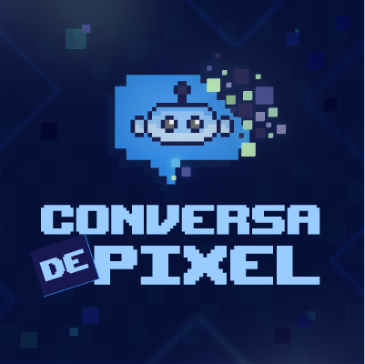

# Dio Lab: Podcast gerado com o auxílio de IAs
Este projeto é um podcast para uma das aulas do bootcamp Fundamentos de IA para Devs da plataforma DIO, em parceria com o Santander. 

A proposta foi criar um podcast com o auxílio de IAs.

## O podcast: Conversa de Pixel

**Episódio piloto:**

  <audio controls>
    <source src="outputs/podcast_editado.MP3" type="audio/mp3">
    Erro: O áudio não pode ser reproduzido. Para ouvir o áudio do podcast, siga o caminho da pasta outputs e acesse o arquivo <b>podcast_editado.mp3</b> neste repositório. 
  </audio>

## Tecnologias utilizadas no projeto
### Ferramentas com IA utilizadas 
- [ChatGPT](https://openai.com/chatgpt/): para gerar roteiro e ideias de nome; 
- [ElevenLabs](https://elevenlabs.io/): áudio do podcast;

### Ferramentas utilizadas
- [Capcut](https://www.capcut.com/): edição e cortes do áudio, adição de música e efeitos; 
- [Illustrator](https://www.adobe.com/br/products/illustrator.html): criação do logo, ícone e imagem de capa; 
- [Pixilart.com](https://www.pixilart.com/): Para desenhar o robô. 

---

## A Criação 

### Roteiro

O primeiro passo foi gerar prompts para o ChatGPT: 

> Qual o melhor tema para um formato de podcast, em que apenas o conteúdo em áudio e não em vídeo (visível aos olhos) possa ser elaborado e explicado, entre os temas a seguir?
>
> - Web Design
> - Front-End
> - Design Gráfico

Uma das instruções do projeto era fazer um podcast sobre algo que o aluno já tenha alguma familiaridade. Pedi ajuda para o ChatGPT para escolher um tema :wink:. A temática do podcast é Web Design, que pode abarcar diferentes subáreas como front-end, design gráfico, design UX/UI e até mesmo back-end. 

O segundo passo foi pedir temas para o primeiro episódio do podcast: 

> Sugira até 10 temas para um episódio de podcast de webdesign. 

Pedi também uma simulação curta da introdução de cada um dos temas, para analisar como o roteiro ficaria: 

> Faça apenas uma simulação do início do script sobre cada um desses temas (de 1 a 10) para o podcast. 

Dentre as simulações, o tópico que mais se encaixou, "Princípios de Design Responsivo", foi o escolhido. 

Para finalizar, o prompt para o roteiro: 

> Complete o script do primeiro tópico "Princípios de Design Responsivo". Você é um roteirista de podcast, e vamos criar um roteiro de um podcast de web design cujo o nome é "Conversa de Pixel" e tem foco em web design, com o público alvo de iniciantes em web design:
> {REGRAS}
> - O podcast deve conter até 3 minutos de duração.
> - Não use muitos termos técnicos. 
> - Explique de forma simples e direta até 3 princípios de forma resumida e ofereça algum conteúdo extra.

**O roteiro final ficou assim:**

<blockquote>
Bem-vindos ao "Conversa de Pixel", o seu podcast sobre web design e inovação! No episódio de hoje, vamos mergulhar no fascinante mundo do design responsivo. Prepare-se para descobrir as melhores práticas e ferramentas para criar layouts que se adaptam a qualquer tela. Vamos começar!

O design responsivo é uma abordagem que visa criar sites que se ajustam automaticamente ao tamanho da tela do dispositivo que está sendo usado para visualizá-los. Isso significa que, seja em um smartphone, tablet ou desktop, o site oferece uma experiência de usuário ótima.

Para entender melhor, pense em um site que você visita frequentemente. Quando você o abre no seu celular, você não precisa dar zoom ou mover a tela de um lado para o outro para ver o conteúdo, certo? Isso acontece porque o site foi projetado de forma responsiva.

Vamos falar sobre alguns princípios fundamentais do design responsivo: Grade Flexível, Imagens Flexíveis e Media Queries.

---

**Teste em Diversos Dispositivos:** Não se limite a testar seu design apenas no seu computador. Use emuladores e dispositivos reais para garantir que tudo funcione bem em diferentes telas.

**Priorize o Conteúdo:** Em telas menores, menos é mais. Foque no conteúdo essencial e simplifique o design para melhorar a usabilidade.

**Adote uma Abordagem Mobile-First:** Comece desenhando para dispositivos móveis e, em seguida, expanda para telas maiores. Isso ajuda a garantir que seu design funcione bem em qualquer contexto.

---

Agora, vamos conhecer algumas práticas recomendadas:

**Teste em Diversos Dispositivos:** Não se limite a testar seu design apenas no seu computador. 

**Priorize o Conteúdo:** Em telas menores, menos é mais. 

**Adote uma Abordagem Mobile-First:** Comece desenhando para dispositivos móveis e, em seguida, expanda para telas maiores. 

Isso ajuda a garantir que seu design funcione bem em qualquer contexto.

---

E por hoje é só! Espero que estas dicas sobre design responsivo tenham sido úteis. Lembre-se, um bom design responsivo não é apenas uma tendência, mas uma necessidade no mundo atual, onde a maioria dos usuários acessa a web por meio de dispositivos móveis.

Obrigado por nos ouvir no "Conversa de Pixel"! Se você gostou deste episódio, não se esqueça de se inscrever e compartilhar. Até a próxima!

</blockquote>

### Nome

Para o nome do Podcast, pedi uma lista para o ChatGPT com nomes para um podcast de Web Design e fiz algumas modificações. 

> Gere uma lista com até 10 nomes para um podcast de Web Design com público jovem. 

### Áudio do roteiro

Para gerar o áudio, usei a ferramenta de IA ElevenLabs. Primeiro, gerei o roteiro completo em áudio. Depois, gerei isoladamente algumas partes específicas que ficaram 'uncanny' (com o tom de voz muito macabro), empolgados demais ou sérios demais. 

A edição do áudio foi feita por mim no CapCut, com adição de música, efeitos, além de edições no áudio da IA. 

### Imagem

Para a imagem, criei um logo do zero a partir delas no Illustrator. Usei o site Pixilart para desenhar o robô da imagem. 

*O desafio pede o uso de IAs de geração de imagem para a resolução da imagem de capa, como o MidJourney, mas não consegui usar devido à sobrecarga da ferramenta e não possuir assinatura. Usei algumas outras ferramentas de geração de imagem de IA (Copilot Design) apenas para inspiração da imagem da capa e robô. 

---

Este foi o meu projeto do desafio, espero que goste! :blue_heart:
